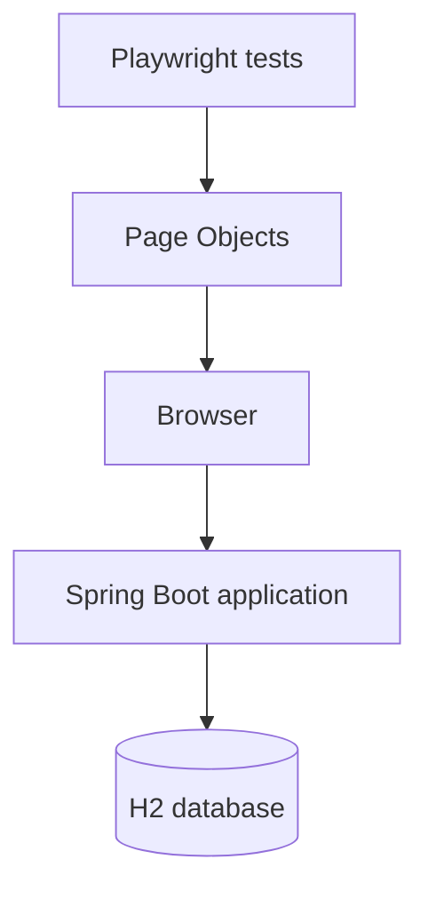

<<<<<<< HEAD
# application-regression-automation

[](https://github.com/OWNER/application-regression-automation/actions/workflows/playwright.yml)

A standalone, portfolio-grade TypeScript/Playwright regression framework for [java-application-support-lab](https://github.com/fetachino/java-application-support-lab). It demonstrates practical QA automation, application-support diagnostics, maintainable test architecture, and CI evidence collection without modifying the Java application.

## Architecture



Page objects own navigation and selector logic; typed fixtures inject them into tests; factories create unique records. Chromium runs with one worker because the application shares mutable in-memory H2 state. The stack is Node.js, TypeScript, Playwright Test, npm, dotenv, GitHub Actions, HTML reporting, and Allure.

## Coverage

The 42 IDs cover smoke (AT-001–003), dashboard/filtering (004–010), creation (011–015), validation (016–021), sorting/pagination (022–029), details/workflow (030–036), errors (037–040), and responsive behavior (041–042). Browser-impossible boundary cases and absent pagination controls are honestly skipped. See [the traceability matrix](docs/regression-suite.md), [automation strategy](docs/automation-strategy.md), and [selector policy](docs/selector-strategy.md).

## Structure

`config/` contains runtime settings; `data/` and `utils/` own test data; `fixtures/` wires reusable page objects; `pages/` contains the Page Object Model; `tests/` contains specs; `docs/` contains strategy and operational guidance; `.github/workflows/` owns CI.

## Prerequisites and setup

- Java 17 and Maven for the application
- Node.js 20+ and npm
- The Java repository cloned separately

Start the application in its repository:

```powershell
mvn spring-boot:run
```

Then, in this repository:

```powershell
npm install
npx playwright install chromium
npm run typecheck
npm run test:smoke
npm run test:regression
```

The defaults work without `.env`. Copy `.env.example` to `.env` to set `BASE_URL`, `HEADLESS`, or `DEFAULT_TIMEOUT`; never commit secrets.

## Commands and reports

- `npm test` — all tests
- `npm run test:smoke` / `npm run test:regression` — tagged suites
- `npm run test:headed`, `test:ui`, `test:debug` — interactive modes
- `npm run test:report` — open the existing HTML report
- `npm run test:allure` then `npm run test:allure:open` — generate/open Allure

Failures retain screenshots and video in `test-results`; CI traces appear on the first retry. Generated reports and evidence are gitignored.

## CI/CD

On push and pull request, Actions checks out both repositories, configures Temurin 17 and Node 22, builds/starts Spring Boot, polls `/tickets`, installs Chromium, type-checks, runs regression sequentially, uploads evidence, and stops the application. Startup, type, or test failures fail the job. See [CI/CD strategy](docs/ci-cd-strategy.md).

## Data, limitations, and roadmap

Unique timestamped titles prevent collisions; tests do not depend on seed IDs. With no cleanup API, records live until H2 restarts. The application has no test IDs, page input, or UI path past maxlength boundaries. Required-field validation is server-side because the form intentionally has `novalidate`; AT-016–018 assert the returned field errors and verify that no row is inserted. Roadmap: API-level boundary tests, deterministic cleanup, Firefox/WebKit projects, accessibility scans, and safe parallelization after isolated data support.

Windows-specific commands are in [local setup](docs/local-environment-setup.md); defect evidence can use [the defect template](docs/defect-report-template.md).
=======
# automated-regression-testing-suite
Professional Playwright and TypeScript regression automation framework for a Spring Boot application using the Page Object Model, GitHub Actions, and Allure reporting.
>>>>>>> af6ce8f484b937a24791b3793b4d30a59745542a
